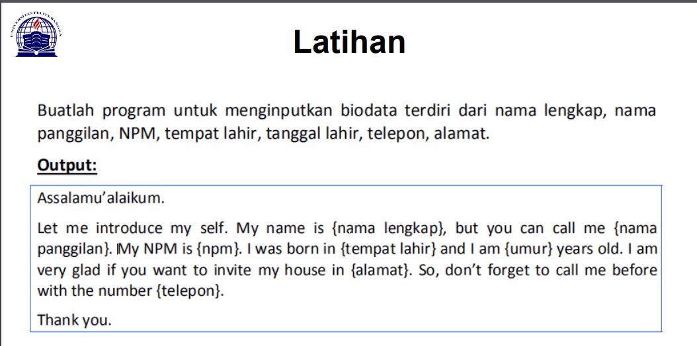
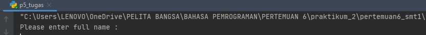
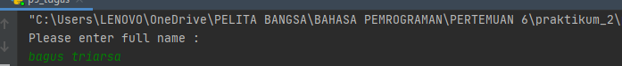
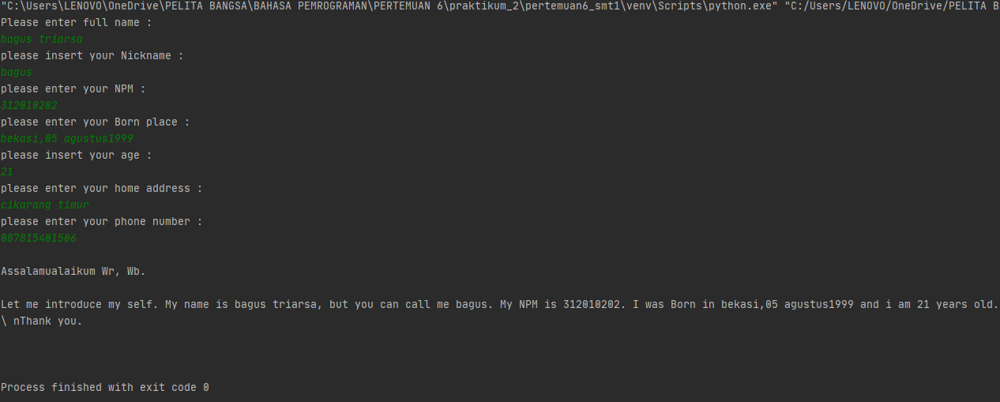

# pertemuan6_smt1
Repository ini dibuat untuk memenuhi tugas Bahasa pemprograman pertemuan 6 <br> <br>
Nama : Bagus Triarsa

NIM  : 312010202

Kelas :TI.20.B.1<br><br>

DAFTAR ISI <br>
| No | Description | Link |
| ----- | ----- | ---- |
| 1 | Tugas pertemuan 5 | [Tugas_pertemuan_5](#pertemuan6_smt1#pertemuan-5---tugas)
| 2 | Tugas pertemuan 6 Lab 1 | [Tugas_part6_Lab1](#pertemuan-6---lab-1)
| 3 | Tugas pertemuan 6 Lab 2 | [Tugas_part6_Lab2](#pertemuan-6---lab-2)
<br>


## pertemuan 5 - Tugas 

pada pertemuan 5 Bahasa Pemprograman  saya diberi tugas oleh Dosen membuat Aplikasi Biodata python (seperti Gambar di bawah ini)
<br>
Saat ini saya akan menjelaskan hasil dari tugas tersebut.<br>
berikut *source code* nya atau klik link berikut : ([tugas pertemuan 5](p5_tugas.py)) <br>
``` python
print("Please enter full name : ")
fullname=input()

print("please insert your Nickname : ")
nickname=input()

print("please enter your NPM : ")
NPM=input()

print("please enter your Born place : ")
bornplace=input()

print("please insert your age : ")
age=input()

print("please enter your home address : ")
address=input()

print("please enter your phone number : ")
phonenumber=input()


print("\nAssalamualaikum Wr, Wb.")
print(f"\nLet me introduce my self. My name is {fullname}, but you can call me {nickname}. My NPM is {NPM}. I was Born in {bornplace} and i am {age} years old. I am very glad if you want to invite my house in {address}. So, don't forget to call me before with the number {phonenumber}.")
print("\nThank you.")
print("\n")
``` pyhton
berikut penjelasannya : <br>
``` python
print("Please enter full name : ")
```
source code diatas berfungsi untuk mencetak hasil / output berupa " **please enter your full name :**" (seperti gambar dibawah ini)<br>
Untuk menampilkan output string, saya menggunkan *tanda petik dua* didalam fungsi print(), sedangkan jika saya ingin menampilkan output /atau hasil berupa 
angka/interger saya tidak perlu menggunakan *tanda petik dua*. contohnya :
```python
print ("Nama saya adalah ...")
print(1234567)
```
<br>
* untuk source code berikutnya adalah inputan atau membuat variable, seperti syntax dibawah ini 
```python
Fullname=input()
```
keterangan :<br>
1.variable adalah sebuah penyimpanan data pada program yang akan digunakan selama program ini berjalan. Yang berfungsi sebagai variable dalam source
code diatas adalah **Fullname** . <br>
2.Fungsi **input ()** adalah untuk memasukan nilai dari layar console di command prompt, lalu kemudian megembalikan nilai saat kita menekan tombol enter 
 *(newline)*<br>
 



Pada gambar diatas, hasil dari inputan tersebut berwarna *hijaw*<br>

* Untuk perintah masukan yang lain seperti *nikname, NPM, Born, age, home, phone number, masukan perintah yang
sama seperti memasukkan *Fullname*

* Langkah kali ini saya akan menampilkan output yang diminta oleh Dosen,<br>
output pertama yang diminta dosen adalah menampilkan salam, yaitu dengan mengertikan 
syntex/source code berikut :
'''python
print("\n\n Assalammu'alikum")
'''
ket :
1. Fungsi ***\n*** pada source code diatas adalah untuk memberi warisan baru / enter / *newline*
2. Fungsi print (), seperti dijelaskan pada point *output* diatas 
Hasil dari source code diatas adalah seperti gambar dibawah ini :

*langkah terakhir adalah menampilkan dari semua inputan diatas. Dengan mengetikkan source code berikut :  <br> 
```python 
print("\nAssalamualaikum wr, wb.")
print("\nLet me introduce my self. My name is {fullname}, but you can call me {nickname}. My NPM is {npm}. I was born in {bornplace} and iam {age} years old. I am 
very glad if you want to invite my house in {adres}. So, don't forget to call me before with 
the number {phonenamber}.")
print("\nThank you.")
```
ket :
1. Fungsi huruf ***f*** pada perintah **print(f"...)** adalah fungsi print yang dapat memudahkan 
programer untuk mencetak statement dalam satu baris dibandingkan dengan metode yang lama yaitu 
memisahkan string dan variable dengan simbol koma ( , ) atau ( + )<br>
2. Sedangkan fungsi {} pada output tersebut adalah untuk menampilkan hasil dari variable<br>
Hasil dari output tersebut adalah :



<br>
---
<br>

## pertemuan 6 - Lab 1

<br>
---
<br>

## pertemuan 6 - Lab 2
