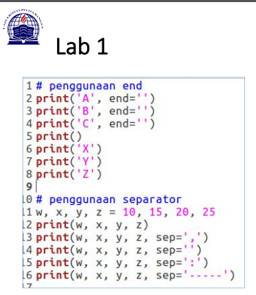
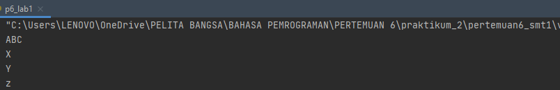
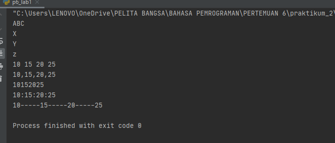
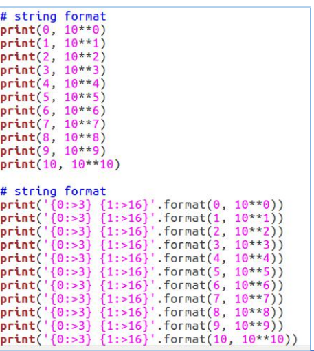
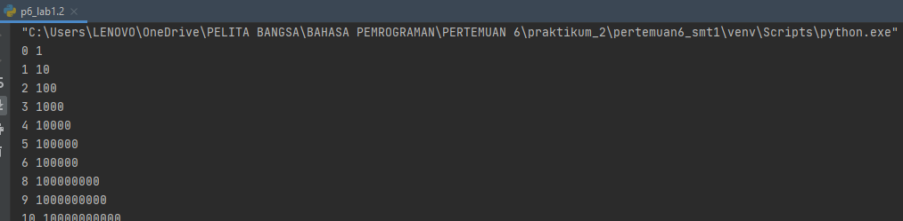
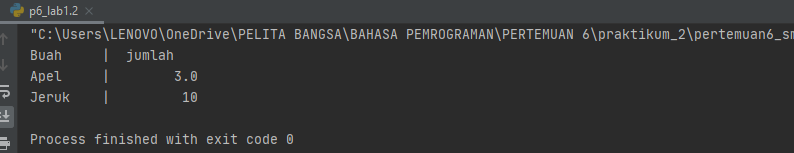
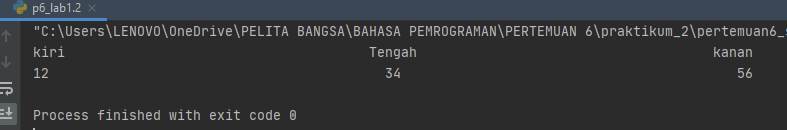
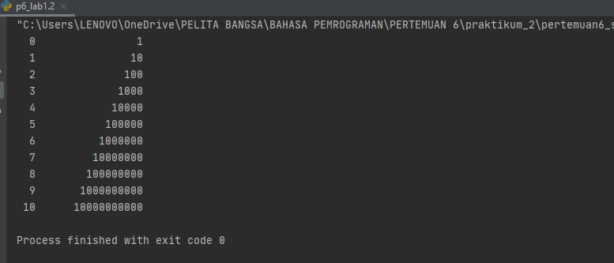

# pertemuan6_smt1
Repository ini dibuat untuk memenuhi tugas Bahasa pemprograman pertemuan 6 <br> <br>
Nama : Bagus Triarsa

NIM  : 312010202

Kelas :TI.20.B.1<br><br>

DAFTAR ISI <br>
| No | Description | Link |
| ----- | ----- | ---- |
| 1 | Tugas pertemuan 5 | [Tugas_pertemuan_5](#pertemuan6_smt1#pertemuan-5---tugas)
| 2 | Tugas pertemuan 6 Lab 1 | [Tugas_part6_Lab1](#pertemuan-6---lab-1)
| 3 | Tugas pertemuan 6 Lab 2 | [Tugas_part6_Lab2](#pertemuan-6---lab-2)
<br>


## pertemuan 5 - Tugas 

pada pertemuan 5 Bahasa Pemprograman  saya diberi tugas oleh Dosen membuat Aplikasi Biodata python (seperti Gambar di bawah ini)
<br>
Saat ini saya akan menjelaskan hasil dari tugas tersebut.<br>
berikut *source code* nya atau klik link berikut : ([tugas pertemuan 5](p5_tugas.py)) <br>
``` python
print("Please enter full name : ")
fullname=input()

print("please insert your Nickname : ")
nickname=input()

print("please enter your NPM : ")
NPM=input()

print("please enter your Born place : ")
bornplace=input()

print("please insert your age : ")
age=input()

print("please enter your home address : ")
address=input()

print("please enter your phone number : ")
phonenumber=input()


print("\nAssalamualaikum Wr, Wb.")
print(f"\nLet me introduce my self. My name is {fullname}, but you can call me {nickname}. My NPM is {NPM}. I was Born in {bornplace} and i am {age} years old. I am very glad if you want to invite my house in {address}. So, don't forget to call me before with the number {phonenumber}.")
print("\nThank you.")
print("\n")
``` pyhton
berikut penjelasannya : <br>
``` python
print("Please enter full name : ")
```
source code diatas berfungsi untuk mencetak hasil / output berupa " **please enter your full name :**" (seperti gambar dibawah ini)<br>
Untuk menampilkan output string, saya menggunkan *tanda petik dua* didalam fungsi print(), sedangkan jika saya ingin menampilkan output /atau hasil berupa 
angka/interger saya tidak perlu menggunakan *tanda petik dua*. contohnya :
```python
print ("Nama saya adalah ...")
print(1234567)
```
<br>
* untuk source code berikutnya adalah inputan atau membuat variable, seperti syntax dibawah ini 
```python
Fullname=input()
```
keterangan :<br>
1.variable adalah sebuah penyimpanan data pada program yang akan digunakan selama program ini berjalan. Yang berfungsi sebagai variable dalam source
code diatas adalah **Fullname** . <br>
2.Fungsi **input ()** adalah untuk memasukan nilai dari layar console di command prompt, lalu kemudian megembalikan nilai saat kita menekan tombol enter 
 *(newline)*<br>
 


Pada gambar diatas, hasil dari inputan tersebut berwarna *hijaw*<br>

* Untuk perintah masukan yang lain seperti *nikname, NPM, Born, age, home, phone number, masukan perintah yang
sama seperti memasukkan *Fullname*

* Langkah kali ini saya akan menampilkan output yang diminta oleh Dosen,<br>
output pertama yang diminta dosen adalah menampilkan salam, yaitu dengan mengertikan 
syntex/source code berikut :
'''python
print("\n\n Assalammu'alikum")
'''
ket :
1. Fungsi ***\n*** pada source code diatas adalah untuk memberi warisan baru / enter / *newline*
2. Fungsi print (), seperti dijelaskan pada point *output* diatas 
Hasil dari source code diatas adalah seperti gambar dibawah ini :

*langkah terakhir adalah menampilkan dari semua inputan diatas. Dengan mengetikkan source code berikut :  <br> 
```python 
print("\nAssalamualaikum wr, wb.")
print("\nLet me introduce my self. My name is {fullname}, but you can call me {nickname}. My NPM is {npm}. I was born in {bornplace} and iam {age} years old. I am 
very glad if you want to invite my house in {adres}. So, don't forget to call me before with 
the number {phonenamber}.")
print("\nThank you.")
```
ket :
1. Fungsi huruf ***f*** pada perintah **print(f"...)** adalah fungsi print yang dapat memudahkan 
programer untuk mencetak statement dalam satu baris dibandingkan dengan metode yang lama yaitu 
memisahkan string dan variable dengan simbol koma ( , ) atau ( + )<br>
2. Sedangkan fungsi {} pada output tersebut adalah untuk menampilkan hasil dari variable<br>
Hasil dari output tersebut adalah :


<br>
---
<br>

## pertemuan 6 - Lab 1
Pada tugas pertemuan 6 - lab 1 saya diberikan tugas oleh Dosen yaitu mempelajari Aritmatika menggunakan bahasa pemprograman python. Berikut 
source code yang diberikan oleh Dosen :

```python
#penggunaan end
print('A', end='')
print('B', end='')
print('C', end='')
print()
print('X')
print('Y')
print('z')

#penggunaan separator
w, x, y, z = 10, 15, 20, 25
print(w, x, y, z)
print(w, x, y, z, sep=',')
print(w, x, y, z, sep='')
print(w, x, y, z, sep=':')
print(w, x, y, z, sep='-----')
```
kali ini saya akan menjelaskan materi yang diterima oleh Dosen.<br><br>

*penggunaan End
penggunaan end digunakan untuk menambahkan karakter yang dicetak di akhir baris. Secara default penggunaan end adalah untuk garis baris.
''' python
print("A", end="")
print("B", end="")
print("C", end="")
'''

> penggunaan print() digunakan untuk mencetak output, seperti syntax dibawah ini :
'''python
print("X")
print("X")
print("Z")
'''
Hasil dari source code tersebut seperti gambar dibawah ini :<br>
![]
print
<br>
<br>

* Penggunaan separator  
Separator adalah pemisah yang berfungsi sebagai tanda pemisah antar objek yang dicetak,. Defautny adalah tanda seperti. <br><br>

> Pendeklarasian beberapa variable beserta nilainya 
```python 
print(w,x,y,z)
```
> Menampilkan hasil dari tiar-tiar variable dengan menggunakan pemisah , (koma)
```python
print(w,x,y,z,sep=",")
```
> Menampilkan hasil dari tiap-tiap variable tanpa menggunakan pemisah
```python 
 print(w,x,y,z,sep=")
```
> Menampilkan hasil dari tiap-tiap dengan menggunakan pemisah : (titik dua)
```python
print(w,x,y,z,sep":")
```

Hasil dari syntax / source code diatas adalah seperti berikut ini : <br>


<br>
<br>
<br>


## pertemuan 6 - Lab 2

*  String format 
Sring formating atau performatan string memungkinkan kita menyuntikan item kedalam string daripada kita mencoba menggunakan string menggunakan koma 
atau string concatanation.<br>

Penggunaan source code yang diberikan oleh dosen seperti berikut : <br>

```python
#string format 1
print(0, 10**0)
print(1, 10**1)
print(2, 10**2)
print(3, 10**3)
print(4, 10**4)
print(5, 10**5)
print(6, 10**5)
print(8, 10**8)
print(9, 10**9)
print(10, 10**10)

#string format 2
print('{0:>3} {1:>16}'.format(0, 10**0))
print('{0:>3} {1:>16}'.format(1, 10**1))
print('{0:>3} {1:>16}'.format(2, 10**2))
print('{0:>3} {1:>16}'.format(3, 10**3))
print('{0:>3} {1:>16}'.format(4, 10**4))
print('{0:>3} {1:>16}'.format(5, 10**5))
print('{0:>3} {1:>16}'.format(6, 10**6))
print('{0:>3} {1:>16}'.format(7, 10**7))
print('{0:>3} {1:>16}'.format(8, 10**8))
print('{0:>3} {1:>16}'.format(9, 10**9))
print('{0:>3} {1:>16}'.format(10, 10**10))
```
<br>
Saat ini saya akan membahas satu persatu dari syntax yang telah diberikan oleh Dosen. <br>

1. String format 1 <br>
Pada syntax / source code string format 1 akan menampilkan output berupa 2 output.<br>
yang pertama (sebelah) akan menampilkan angka urut dari angka 0 hingga angka 10, sedangkan untuk angka sebelah kanan akan menampilkan operasi Aritmatika 
pangkat.<br>
Dengan ketentuan sebagai berikut, operasi pangkat dengan kiri sebagai pokok (Rumus **[bintang dua])<br>


2. **String format 2** <br>
Pada syntax source code string format 2 akan menampilkan output berupa 2 outputan juga (seperti String format 1, yaitu kanan dan kiri)<br>
Dengan ketentuan sebagai berikut : <br>
> Aligment, padding, dan perecesion dengan **.format** dalam kurung kurawal kita dapat menetapkan panjang bidang, rata kanan/kiri, parameter pembulatan 
dan banyak lagi. Contoh lain seperti berikut :
```python
print('{0:8} |  {1:9}'.format('Buah','jumlah'))
print('{0:8} |  {1:9}'.format('Apel', 3.))
print('{0:8} |  {1:9}'.format('Jeruk',10))
```
Hasil dari source code contoh diatas akan seperti berikut :<br>

>Secara Default,  **.format** menggunakan rata teks ke kiri, angka ke kanan. Kita dapat menggunakan opsi opsional <, ^, atau > untuk menggatur perataan 
kiri, tengah, atau kanan. Contoh lain dalam penggunaan **.format()** sebagai berikut : <br>
```python 
print('{:<30}{:^30}{:>30}'.format(kiri',' Tengah kanan))
print('{:<30}{:^30}{:>30}'.format(12,34,56))
```
Hasil dari soucrce code contoh diatas akan muncul seperti ini :<br>

<br><br>
Untuk hasil dari string Format 2 adalah :<br>


  
 